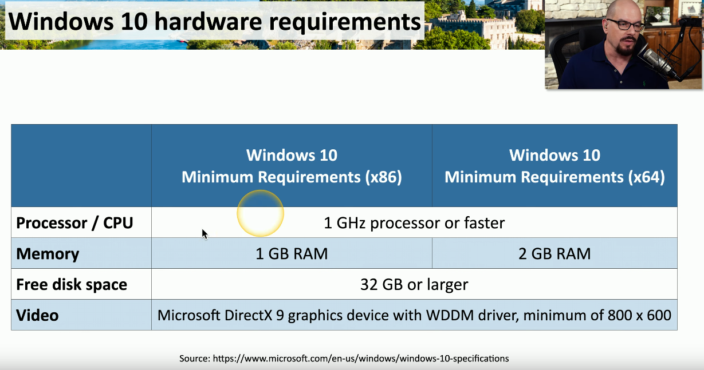

# An Overview of Windows

## Windows keypoints :&#x20;

1 . Microsoft provides support for all windows versions  upto 5 years after release .

2 . Windows 10 and 11 are very similar .

## Windows 10&#x20;

**Keyfeatures :**&#x20;

1. Released on July 29 , 2015
2. Microsoft skipped windows 9 and directly released Windows 10
3. **Goal of windows 10 :**     :point\_right: A single platform , means to have one operating system that would run on different platforms like you can run **`Windows 10`** on Desktops , laptops , tablets , phones , all-in-one-devices
4. **Ongoing updates :** :point\_right: More than twelve different released versions
5. &#x20;                                :point\_right: November 2021 ( Version 21H2)

## Windows 10 Home

**Keyfeatures :**&#x20;

1. Default version of windows for anyone who is outside of work or enterprise environment&#x20;
2. For retail users&#x20;
3. Integration with Microsoft account and it also integrates with Microsoft OneDrive backup .
4. Windows 10 also includes **`Windows Defender`** which provides **Anti-virus and Anti-malware**
5. Many versions of Windows 10 include **`Cortana`** which allows you to talk with your operating system .
6. Use of `Cortana` has decreased over time and Microsoft has started removing `Cortana` from their most recent versions of operating system .

## Windows 10 Pro

**Keyfeatures :**&#x20;

1. The business version of Windows , includes additional management features .&#x20;
2. Windows 10 Pro has ability to set your system as `Remote Desktop Host` , Remotely control each computer . This will allow other people in the organisation to connect to your device and control the desktop .&#x20;
3. Windows 10 pro includes `Bitlocker` : Full disk encryption (FDE), Once you logout of windows everything you stored on your drive is encrypted .
4. Also includes Join a Windows domain that is connect to `Active Directory`: Group police management&#x20;

## Windows 10 pro for Workstations&#x20;

1. An edition for high-end desktops and need enhanced capabilites&#x20;
2. Enhanced performance and storage options&#x20;
3. More physical CPUs : Up to four&#x20;
4. High maximun RAM : Supports up to 6 TB
5. Support for ReFS : Resillient File system - **Same  FIle system thats available for  Windows Server .** This file system is used for enhanced capabilites&#x20;

## Windows 10 Enterprise&#x20;

**Keyfeatures :**&#x20;

1. Built for large implementations and enterprises
2. Volume licensing so that they can deploy  all of the windows systems they need at a reasonable cost .
3. AppLocker : Control what applications can run and cannot be run in a windows enterpirse environment (Useful for Administrators)
4. BranchCache : Remote site file caching
5. Granular User Experience ( UX ) control  : Define the user environment&#x20;
6. &#x20;                                                                    :point\_right:Useful for Kiosk and workstation customization

## Windows 10 Hardware requirements&#x20;

* **x86  Processor = 32 bits processor**&#x20;
* **x64 Processor = 64 bits processor**&#x20;

<figure><figcaption></figcaption></figure>

## Capabilites available in different Windows 10 edition

<figure><figcaption></figcaption></figure>

